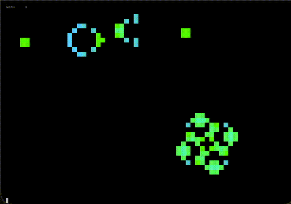

# AA_lifegame
CUI based lifegame 



## How To Build
just
```
 % make
```
## Usage
```
./lifegame [-h] [-w wait(in ms)] [-c colormap(1 - 32)] [-d] [filename]
```
By default, initial scene will be randomly generated.
If a "filename" is specified, the initial scene will be the content of that file.

following options are available:

```
   -c [cmap#]  Enable color。
               You can specify colormap by an integer 
               argument to this option, or if argument
               omitted, the colormap will be randomly 
               choosen. The cmap# is from 1 to 32.
               The list of available colormap is 
               obtaind using the '-h' option.

   -d          show debug information (convergence meter)

   -w wait     Set animation cycle to wait(in ms)

   -h          show help (colormap list is also displayed)
